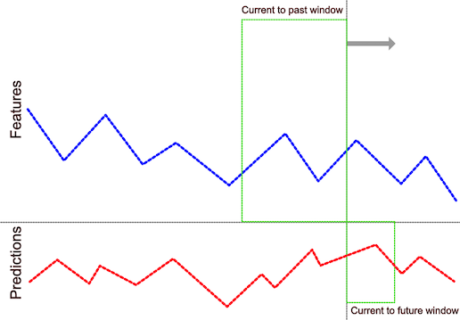

# [tsf](https://github.com/tuantle/tsf)
#### Neural network model creation and training for time series forecast/prediction with Keras + Tensorflow backend.



TSF (time series forecast) is a simple set of python scripts for compiling and training neural network models for time series forecast/prediction. Originally these scripts were created for educational purposes - learning Keras and high level overview of deep learning algorithms. Overtime this project becomes somewhat more useful and now is released as open source.

This was built with the idea of simplifying model compiling and training processes with no need to write any code. The processes are reduced down to dataset preparation in csv format, runs [tsf](https://github.com/tuantle/tsf) command script to compile and training model, and save trained model as HDF5 format.

Some Notable Features:
- Takes time series dataset in simple CSV format
- Adjustable window size - how far to look into the past data points to make prediction for the next future data point
- Auto features extraction
- Build recurrence neural network models with a few command options
- Auto compile model for training
- Save trained model as HDF5 binary format

----

- [Installation](#installation)
- [Tutorials](#tutorials)
- [Dataset Format](#command-options)
- [Command Options](#dataset-format)
- [Change Log](#change-log)
- [License](#license)

### Installation

If using OSX, first install python3 with homebrew. Go here if you don't have homebrew installed(https://brew.sh).

```
brew install python3
```

Use pip3 to install virtualenv and virtualenvwrapper

```
pip3 install virtualenv virtualenvwrapper
```

Add these lines to your .bashrc

```
export WORKON_HOME=$HOME/.virtualenvs
export VIRTUALENVWRAPPER_PYTHON=/usr/local/bin/python3
export VIRTUALENVWRAPPER_VIRTUALENV=/usr/local/bin/virtualenv
source /usr/local/bin/virtualenvwrapper.sh
```

Clone tsf project folder from github and activate it with virtualenv:

```
git clone https://github.com/tuantle/tsf.git
virtualenv tsf
cd tsf
source bin/activate
```

In the activated tsf dir, install the required packages, which includes keras, tensorflow, numpy, ...etc:
```
pip3 install -r packages.txt
```

That’s it!

----

### Tutorials
To understand how to use [tsf](https://github.com/tuantle/tsf) tool to build models for time series classification or regression forecasting, please check out the tutorials in the links below.

+ [Tutorial 1 - Forecasting Sunspot Monthly Occurrence (*Single Variable Regression*)](https://github.com/tuantle/tsf/blob/master/examples/sunspot/TUTORIAL.md)
+ [Tutorial 2 - Forecasting Air Quality (*Multi-Variable Regression With Auto Features Extraction*)](https://github.com/tuantle/tsf/blob/master/examples/air_quality/TUTORIAL.md)
+ [Tutorial 3 - Forecasting Room Occupancy (*Multi-Variable Classification*)](https://github.com/tuantle/tsf/blob/master/examples/occupancy/TUTORIAL.md)

----

### Dataset Format

TSF takes dataset in CSV format. All NA or non-numerical data points must be transformed or removed. Next, rearrange the columns so that the first column is the Index (this column will be ignored), the next set of columns are the features, and second set of columns are the predictions. The feature and prediction column labels can be anything.
Use required command options ***--feature_size*** and ***--prediction_size*** to tell the script which set is which.

| N   | Feature1 | Feature2 | ... | FeatureN | Prediction1 | Prediction2 | ... | PredictionN |
|-----|----------|----------|-----|----------|-------------|-------------|-----|-------------|
| 1   |          |          |     |          |             |             |     |             |
| 2   |          |          |     |          |             |             |     |             |
| 3   |          |          |     |          |             |             |     |             |

### Command Options
```
python tsf.py
```
Param (short) | Param (full)                     | Default | Required | Description
--------------|----------------------------------|---------|----------|------------
-a            | --action                         | None    | Yes      | 2 possible action types: compile or train
-m            | --model                          | None    | Yes      | Model filename
-o            | --objective                      | None    | Yes      | Learning objective. For regression, possible values are: mse, mae, lcl. For classification, possible values are: bce, cce
-opt          | --optimizer                      | adam    | No       | Optimization method, possible values are: sgd, rmsprop, adagrad, adadelta, adam, adamax. Default is adam
-rl           | --recurrent_layer_size           | 2       | No       | Number of recurrent layers in the model. Default is 2 at minimum
-dl           | --dense_layer_size               | 2       | No       | Number of dense layers in the model. Default is 2 at minimum
-dr           | --dropout_rate                   | 0       | No       | Hidden layers dropout rate. Default is 0 or off
-ir           | --input_l1_l2                    | 0       | No       | Input layers L1 & L2 regularizer. Default is 0 or off
-bn           | --batch_normalize                | False   | No       | Enable batch normalization at every layer output
-ds           | --ts_dataset                     | None    | Yes      | Input time series dataset filename
-ep           | --epochs                         | 50      | No       | Number of training epochs. Default is 50
-b            | --batch_size                     | 32      | No       | Size of training batch. Default is 32
-vp           | --validation_split               | 0.2     | No       | Training vs validating split ratio. Default is 0.2
-ilr          | --initial_learning_rate          | 0.002   | No       | Initial learning rate. Default is 0.002
-lrd          | --learning_rate_drop             | 0.15    | No       | Learning rate step decay/drop. Default is 0.15
-w            | --window                         | No      | Yes      | Current to past window frame in number of time step periods
-f            | --feature_size                   | No      | Yes      | Number of features
-ef           | --extracted_feature_size         | 0       | No       | Number of features extracted via autoencoder
-p            | --prediction_size                | No      | Yes      | Number of predictions
-bem          | --binary_encoded_model           | True    | No       | Encode output model HDF5 as BIN format
-v            | --verbose                        | False   | No       | Verbose mode, show summary and plots
```
Notes on --objective:
    mse = mean square error (with linear activation on final layer output)
    mae = mean absolute error (with linear activation on final layer output)
    lcl = log-cosh loss (with linear activation on final layer output)

    bcl = binary cross-entropy (with sigmoid activation on final layer output)
    ccl = category cross-entropy (with softmax activation on final layer output)
```
---

## Change Log
**0.1.0 (10/10/2018)**
```
    - Initial Commit Version!!!
```

## License

[tsf](https://github.com/tuantle/tsf) is [MIT licensed](./LICENSE).
